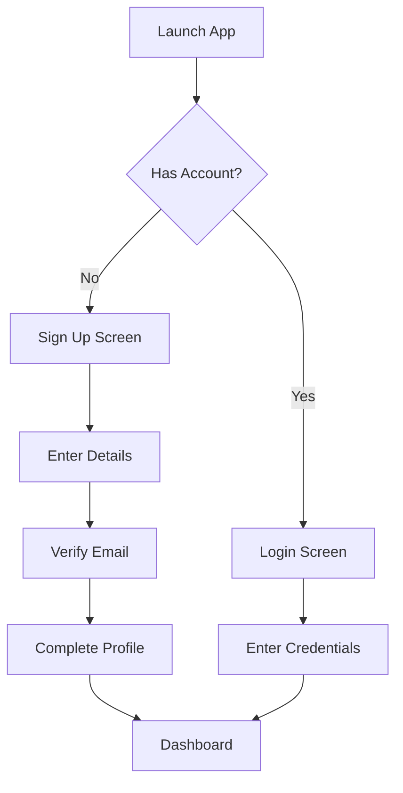
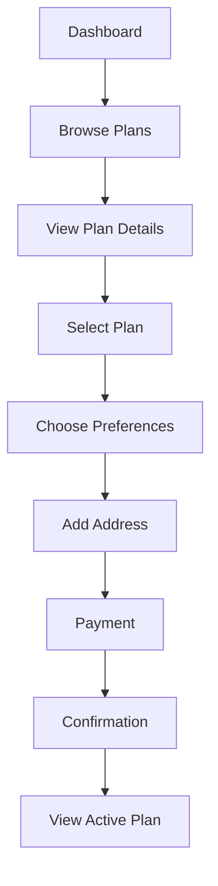
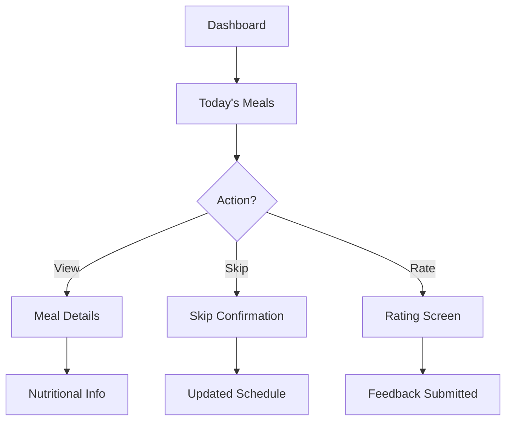
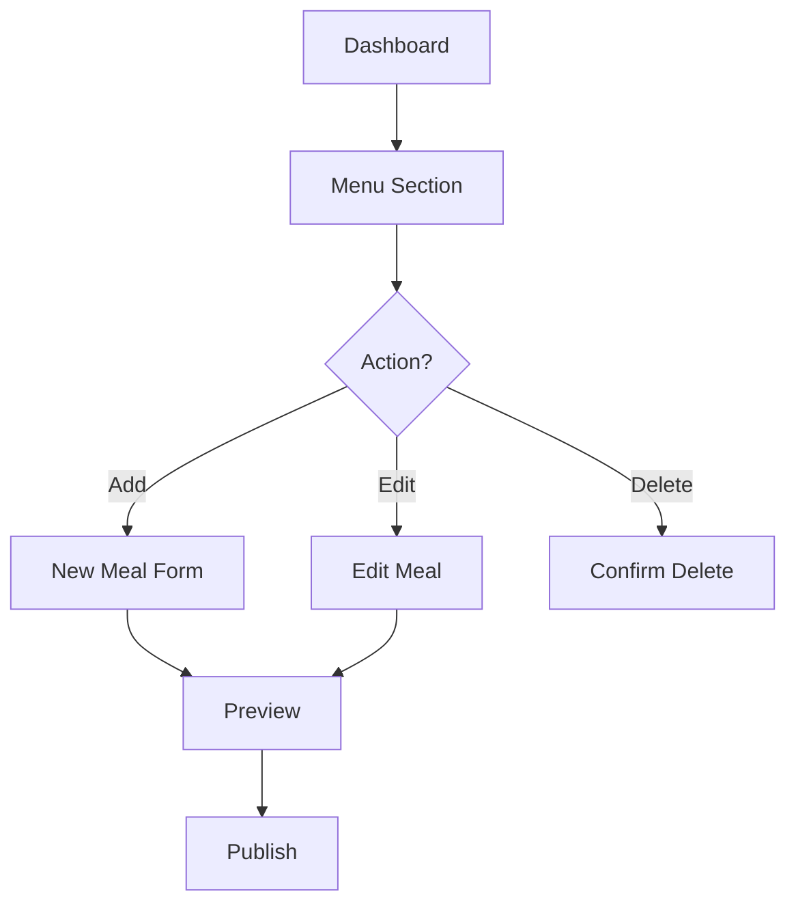
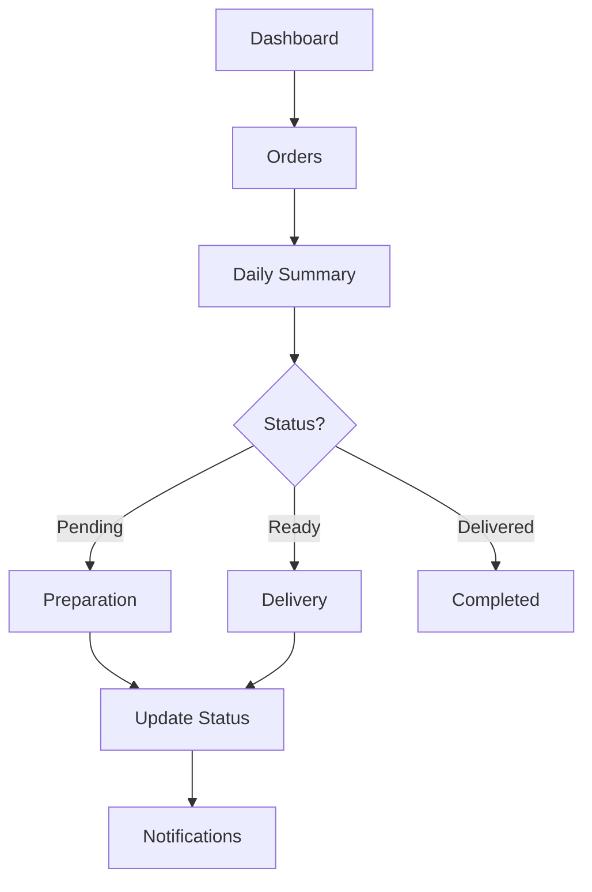

# Mobile App Wireframes and User Flows

## Customer App Flows

### 1. Authentication Flow


### 2. Subscription Flow


### 3. Daily Meal Management Flow


## Vendor App Flows

### 1. Menu Management Flow


### 2. Order Management Flow


## Screen Layouts

### Customer Screens

#### 1. Dashboard
```
+------------------------+
|     Header/Profile     |
+------------------------+
| Today's Meals         |
| [Meal Cards]          |
+------------------------+
| Active Subscription   |
| [Plan Details]        |
+------------------------+
| Quick Actions         |
| [Skip][Rate][Support] |
+------------------------+
| Bottom Navigation     |
+------------------------+
```

#### 2. Plan Browser
```
+------------------------+
|   Search/Filter Bar    |
+------------------------+
| Featured Plans        |
| [Scrollable Cards]    |
+------------------------+
| All Plans            |
| [List View]          |
+------------------------+
| Bottom Navigation     |
+------------------------+
```

### Vendor Screens

#### 1. Vendor Dashboard
```
+------------------------+
|     Header/Profile     |
+------------------------+
| Today's Summary       |
| [Orders][Revenue]     |
+------------------------+
| Active Subscriptions  |
| [List View]          |
+------------------------+
| Recent Activity      |
| [Activity Feed]      |
+------------------------+
| Bottom Navigation     |
+------------------------+
```

#### 2. Menu Manager
```
+------------------------+
|     Header/Actions     |
+------------------------+
| Calendar View         |
| [Week Selector]       |
+------------------------+
| Meal Slots           |
| [Breakfast]          |
| [Lunch]              |
| [Dinner]             |
+------------------------+
| Bottom Navigation     |
+------------------------+
```

## Design Guidelines

### Color Palette
- Primary: #FF5722 (Orange)
- Secondary: #2196F3 (Blue)
- Success: #4CAF50 (Green)
- Warning: #FFC107 (Yellow)
- Error: #F44336 (Red)
- Background: #FFFFFF (White)
- Text: #333333 (Dark Gray)

### Typography
- Headings: SF Pro Display
- Body: SF Pro Text
- Sizes:
  - H1: 24px
  - H2: 20px
  - H3: 18px
  - Body: 16px
  - Caption: 14px

### Component Styling
- Border Radius: 8px
- Shadow:
  - Elevation 1: 0 2px 4px rgba(0,0,0,0.1)
  - Elevation 2: 0 4px 8px rgba(0,0,0,0.1)
  - Elevation 3: 0 8px 16px rgba(0,0,0,0.1)
