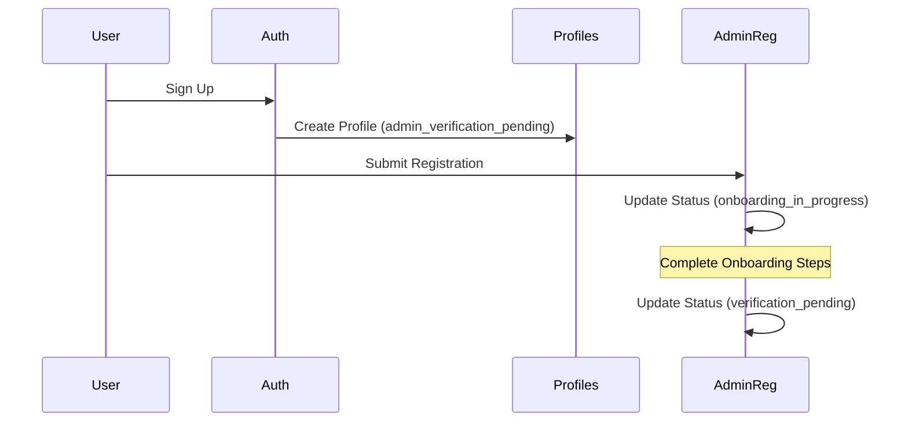
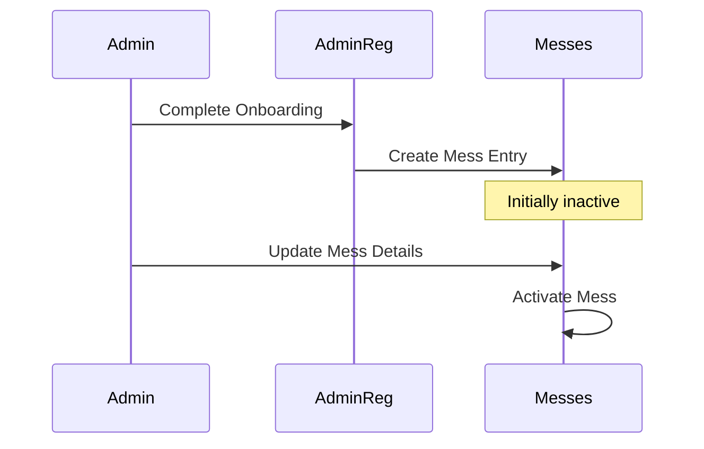

# Supabase Database Overview

This document provides a comprehensive overview of the Clanify app's database structure implemented in Supabase.

## The Core Identity System

Think of profiles like a city's resident database. Every person in your app ecosystem, whether they're eating at messes or running them, has an entry here. This table answers the basic question **"Who is this person?"** It's directly connected to Supabase's authentication system, which handles passwords and security.

The `profiles` table is your main user database. It's like a permanent record of everyone who uses your app — both regular users (**members**) who want to eat at messes and verified mess owners (**admins**) who run them. Every active user in your app must have a record in this table.

## The Business Registration Office

The `admin_registrations` table is like a city's business licensing office. When someone wants to open a mess, they first submit their application here. This table keeps track of all the paperwork, verifications, and the approval process. It's like the paper trail that shows how a mess came to be.

Think of `admin_registrations` like a waiting room or an application processing center. When someone wants to become a mess owner (**admin**), they need to prove they can actually run a mess — they need proper facilities, documentation, and so on. We can't just let anyone become an admin immediately.

Here's how the tables work together in your application's lifecycle:

The `admin_registrations` table is specifically for processing new mess owners. Think of it as an application form with multiple pages (your onboarding steps). Even after someone completes their registration and becomes an admin, their registration record stays in this table. This serves several purposes:

1. Historical record of the verification process
2. Proof of submitted documents and information
3. Ability to audit who approved what and when
4. Reference for any future disputes or verifications

## The Business Directory

The `messes` table is like the city's active business directory. Once a mess owner is approved, their operational information lives here. This is what your app actually uses day-to-day to show users what messes are available, where they are, and what they offer.

---

## Database Schema

### Core Tables

#### 1. profiles

This table stores user profile information and serves as an extension to Supabase's auth.users table.

```sql
CREATE TABLE profiles (
    id UUID PRIMARY KEY REFERENCES auth.users(id),
    first_name TEXT,
    last_name TEXT,
    role user_role,
    phone_number TEXT,
    updated_at TIMESTAMP WITHOUT TIME ZONE
);
```

#### 2. admin_registrations

Manages the mess administrator registration and onboarding process.

```sql
CREATE TABLE admin_registrations (
    id UUID PRIMARY KEY,
    email TEXT,
    first_name TEXT,
    last_name TEXT,
    status admin_verification_status,
    current_onboarding_step onboarding_step,
    mess_details JSONB,
    location_details JSONB,
    contact_details JSONB,
    timing_details JSONB,
    media_files JSONB,
    verification_notes TEXT,
    created_at TIMESTAMPTZ,
    updated_at TIMESTAMPTZ,
    submitted_at TIMESTAMPTZ
);
```

#### 3. messes

Stores information about registered mess businesses.

```sql
CREATE TABLE messes (
    id UUID PRIMARY KEY,
    admin_id UUID REFERENCES auth.users(id),
    name TEXT,
    description TEXT,
    type mess_type,
    capacity INTEGER,
    monthly_rate NUMERIC,
    security_deposit NUMERIC,
    coordinates POINT,
    timings JSONB,
    photos JSONB,
    is_active BOOLEAN,
    email TEXT,
    phone TEXT,
    alternate_phone TEXT,
    website TEXT,
    street TEXT,
    area TEXT,
    city TEXT,
    state TEXT,
    pincode TEXT,
    specialties TEXT[],
    establishment_year TEXT,
    created_at TIMESTAMPTZ,
    updated_at TIMESTAMPTZ
);
```

### Views

#### active_messes_view

A view that combines mess information with admin details for active messes.

## Custom Types

### 1. User Roles

```sql
CREATE TYPE user_role AS ENUM (
    'admin',
    'member',
    'admin_verification_pending'
);
```

### 2. Admin Verification Status

```sql
CREATE TYPE admin_verification_status AS ENUM (
    'pending_onboarding',
    'onboarding_in_progress',
    'verification_pending',
    'approved',
    'rejected'
);
```

### 3. Mess Type

```sql
CREATE TYPE mess_type AS ENUM (
    'veg',
    'non-veg',
    'both'
);
```

### 4. Onboarding Step

```sql
CREATE TYPE onboarding_step AS ENUM (
    'mess_details',
    'location_details',
    'contact_details',
    'timing_details',
    'media_files'
);
```

## Row Level Security (RLS)

### profiles Table

1. View Profiles:
   - Users can view their own profile
   - Admins can view all profiles
2. Update Profiles:
   - Users can only update their own profile
3. Insert Profiles:
   - Enabled for all authenticated users
4. Delete Profiles:
   - Disabled for all users

### messes Table

1. View Messes:
   - Admins can view their own mess
   - Members can view active messes
2. Update Messes:
   - Admins can only update their own mess

### admin_registrations Table

1. View Registrations:
   - Users can view their own registration
2. Insert Registrations:
   - Open to all users (necessary for signup flow)
3. Update Registrations:
   - Users can update their own registration

## Data Flow Examples

### 1. Admin Registration Process



### 2. Mess Creation Flow



## Security Considerations

1. Auth Integration

   - Tight integration with Supabase Auth
   - JWT-based authentication
   - Role-based access control

2. Data Protection

   - RLS policies protect user data
   - No direct table deletion allowed
   - Sensitive fields use appropriate data types

3. Validation
   - Enum types enforce valid states
   - JSONB fields for flexible but structured data
   - Foreign key constraints maintain referential integrity

## Best Practices

1. Data Access

   - Always use RLS policies for data access
   - Verify user roles before operations
   - Use provided functions for complex operations

2. Data Modifications

   - Update timestamps for audit trails
   - Maintain referential integrity
   - Follow the defined state transitions

3. Performance
   - Use the active_messes_view for read operations
   - Index frequently queried columns
   - Structure JSONB data appropriately

## Common Operations

### 1. Checking Admin Status

```sql
SELECT
    status,
    current_onboarding_step
FROM admin_registrations
WHERE email = user_email;
```

### 2. Retrieving Active Messes

```sql
SELECT * FROM active_messes_view
WHERE is_active = true
  AND city = user_city;
```

### 3. Updating Mess Details

```sql
UPDATE messes
SET
    name = new_name,
    description = new_description,
    updated_at = NOW()
WHERE
    id = mess_id
    AND admin_id = auth.uid();
```

## Maintenance Considerations

1. Regular Tasks

   - Monitor table sizes
   - Check for orphaned records
   - Verify RLS policy effectiveness

2. Performance Optimization

   - Review and update indexes
   - Analyze query patterns
   - Optimize JSONB storage

3. Data Integrity
   - Regular backup scheduling
   - Validation of foreign key relationships
   - Monitoring of enum value usage
